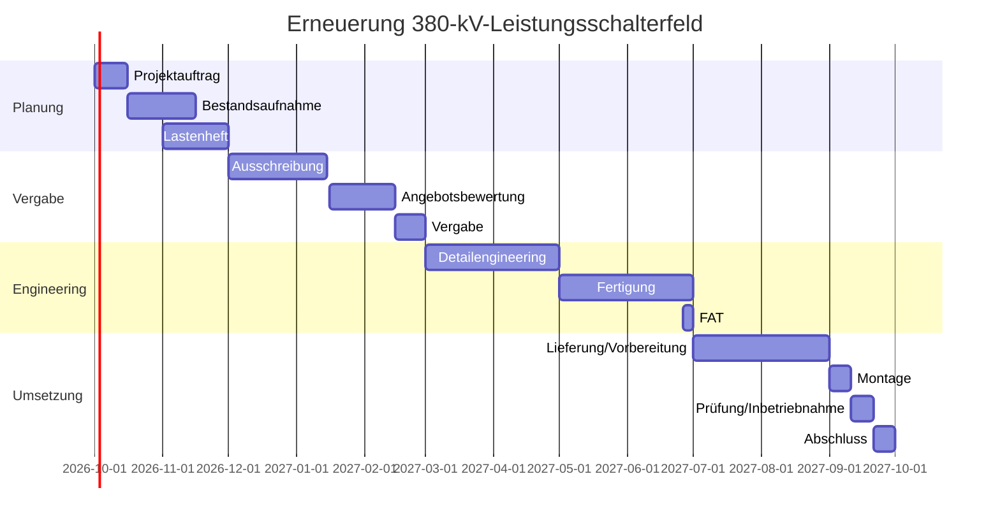

# 4. Termin- und Meilensteinplanung

## 4.1 Meilensteine

| Meilenstein | Termin | Freigabekriterium |
|---|---|---|
| M1 Projektauftrag freigegeben | 15.10.2026 | Ziele, Budgetrahmen und Rollen bestätigt |
| M2 Lastenheft freigegeben | 30.11.2026 | Anforderungen und Schnittstellen abgestimmt |
| M3 Auftrag vergeben | 28.02.2027 | Technische und kaufmännische Freigabe |
| M4 Design Review abgeschlossen | 30.04.2027 | Zeichnungen und Schnittstellen freigegeben |
| M5 FAT bestanden | 30.06.2027 | Prüfprotokoll ohne kritische Abweichungen |
| M6 Montagebereitschaft | 31.08.2027 | Material, Personal, Freigaben und Abschaltung bestätigt |
| M7 Inbetriebnahme | 20.09.2027 | Funktions- und Schutzschnittstellen geprüft |
| M8 Projektabschluss | 30.09.2027 | Abnahme, Dokumentation und Restpunktplan vorhanden |

## 4.2 Kritischer Pfad

Der angenommene kritische Pfad lautet:

**Lastenheft → Vergabe → Engineering → Fertigung → FAT → Lieferung → Abschaltung → Montage → Prüfung → Inbetriebnahme**

Verzögerungen auf diesem Pfad werden wöchentlich geprüft. Für nichtkritische Vorgänge werden Puffer genutzt, bevor der Endtermin angepasst wird.

## 4.3 Terminsteuerung

- Monatliche Aktualisierung des Gesamtterminplans.
- Zweiwöchentliche Abstimmung während Engineering und Fertigung.
- Tägliches Baustellen-Stand-up im Abschaltfenster.
- Eskalation bei mehr als fünf Arbeitstagen Prognoseverzug.
- Maßnahmenplan mit Verantwortlichem und Fälligkeit für jede kritische Abweichung.

## 4.4 Mermaid-Gantt

