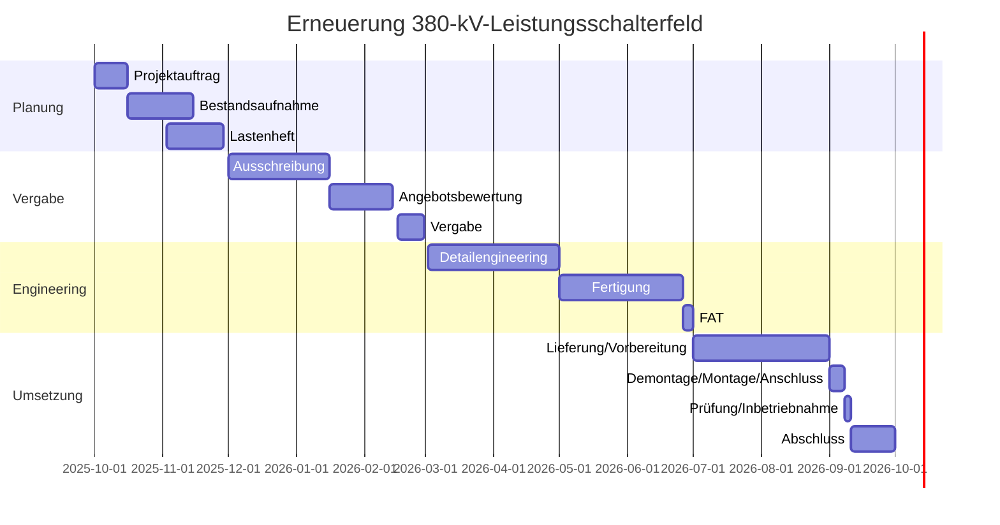
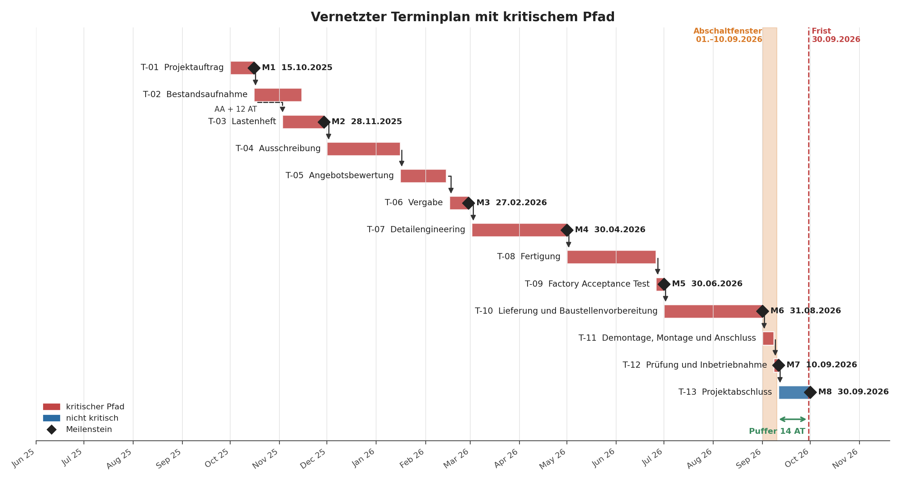

# 4. Termin- und Meilensteinplanung

## 4.1 Meilensteine

| Meilenstein | Termin | Freigabekriterium |
|---|---|---|
| M1 Projektauftrag freigegeben | 15.10.2025 | Ziele, Budgetrahmen und Rollen bestätigt |
| M2 Lastenheft freigegeben | 28.11.2025 | Anforderungen und Schnittstellen abgestimmt |
| M3 Auftrag vergeben | 27.02.2026 | Technische und kaufmännische Freigabe |
| M4 Design Review abgeschlossen | 30.04.2026 | Zeichnungen und Schnittstellen freigegeben |
| M5 FAT bestanden | 30.06.2026 | Prüfprotokoll ohne kritische Abweichungen |
| M6 Montagebereitschaft | 31.08.2026 | Material, Personal, Freigaben und Abschaltung bestätigt |
| M7 Inbetriebnahme | 10.09.2026 | Funktions- und Schutzschnittstellen geprüft |
| M8 Projektabschluss | 30.09.2026 | Abnahme, Dokumentation und Restpunktplan vorhanden |

## 4.2 Kritischer Pfad

Der angenommene kritische Pfad lautet:

**Lastenheft → Vergabe → Engineering → Fertigung → FAT → Lieferung → Abschaltung → Montage → Prüfung → Inbetriebnahme**

Verzögerungen auf diesem Pfad werden wöchentlich geprüft (Puffer und Toleranzen siehe 4.7). Für nichtkritische Vorgänge werden Puffer genutzt, bevor der Endtermin angepasst wird.

## 4.3 Terminsteuerung

- Monatliche Aktualisierung des Gesamtterminplans.
- Zweiwöchentliche Abstimmung während Engineering und Fertigung.
- Tägliches Baustellen-Stand-up im Abschaltfenster.
- Eskalation bei mehr als fünf Arbeitstagen Prognoseverzug.
- Maßnahmenplan mit Verantwortlichem und Fälligkeit für jede kritische Abweichung.

## 4.4 Mermaid-Gantt

```mermaid
gantt
    title Erneuerung 380-kV-Leistungsschalterfeld
    dateFormat  YYYY-MM-DD
    section Planung
    Projektauftrag           :2025-10-01, 15d
    Bestandsaufnahme         :2025-10-16, 30d
    Lastenheft               :2025-11-03, 26d
    section Vergabe
    Ausschreibung            :2025-12-01, 46d
    Angebotsbewertung        :2026-01-16, 29d
    Vergabe                  :2026-02-16, 12d
    section Engineering
    Detailengineering        :2026-03-02, 60d
    Fertigung                :2026-05-01, 56d
    FAT                      :2026-06-26, 5d
    section Umsetzung
    Lieferung/Vorbereitung   :2026-07-01, 62d
    Demontage/Montage/Anschluss :2026-09-01, 7d
    Prüfung/Inbetriebnahme   :2026-09-08, 3d
    Abschluss                :2026-09-11, 20d
```

## 4.5 Vernetzter Terminplan (Vorgänge und Abhängigkeiten)

Quelle: `data/terminplan.csv`. EA = Endfolge (Nachfolger startet nach dem Ende des Vorgängers), AA = Anfangsfolge mit Versatz. Dauer in Arbeitstagen (Montag bis Freitag, ohne Feiertage).

| ID | Vorgang | Start | Ende | Dauer (AT) | Vorgänger | Beziehung | Nachfolger | Kritisch | Meilenstein |
|---|---|---|---|---:|---|---|---|---|---|
| T-01 | Projektauftrag | 01.10.2025 | 15.10.2025 | 11 | - | - | T-02 | Ja | M1 |
| T-02 | Bestandsaufnahme | 16.10.2025 | 14.11.2025 | 22 | T-01 | EA | T-03 | Ja | - |
| T-03 | Lastenheft | 03.11.2025 | 28.11.2025 | 20 | T-02 | AA+12AT | T-04 | Ja | M2 |
| T-04 | Ausschreibung | 01.12.2025 | 15.01.2026 | 34 | T-03 | EA | T-05 | Ja | - |
| T-05 | Angebotsbewertung | 16.01.2026 | 13.02.2026 | 21 | T-04 | EA | T-06 | Ja | - |
| T-06 | Vergabe | 16.02.2026 | 27.02.2026 | 10 | T-05 | EA | T-07 | Ja | M3 |
| T-07 | Detailengineering | 02.03.2026 | 30.04.2026 | 44 | T-06 | EA | T-08 | Ja | M4 |
| T-08 | Fertigung | 01.05.2026 | 25.06.2026 | 40 | T-07 | EA | T-09 | Ja | - |
| T-09 | Factory Acceptance Test | 26.06.2026 | 30.06.2026 | 3 | T-08 | EA | T-10 | Ja | M5 |
| T-10 | Lieferung und Baustellenvorbereitung | 01.07.2026 | 31.08.2026 | 44 | T-09 | EA | T-11 | Ja | M6 |
| T-11 | Demontage, Montage und Anschluss | 01.09.2026 | 07.09.2026 | 5 | T-10 | EA | T-12 | Ja | - |
| T-12 | Prüfung und Inbetriebnahme | 08.09.2026 | 10.09.2026 | 3 | T-11 | EA | T-13 | Ja | M7 |
| T-13 | Projektabschluss | 11.09.2026 | 30.09.2026 | 14 | T-12 | EA | - | Nein | M8 |

Das Lastenheft (T-03) beginnt zwölf Arbeitstage nach dem Start der Bestandsaufnahme (AA + 12 AT), sobald die Schnittstellenerfassung (2.2) vorliegt. Es endet nach der Bestandsaufnahme.

## 4.6 Gantt-Diagramm mit kritischem Pfad

## 4.7 Kritischer Pfad, Puffer und Toleranzen

- **Kritischer Pfad:** T-01 bis T-12 (siehe 4.2). Alle Vorgänge folgen einander ohne Überlappung. Jede Verzögerung wirkt direkt auf M7.
- **Gesamtpuffer:** Die Frist für die Wiederinbetriebnahme ist der 30.09.2026 (Ziel 5). M7 liegt am 10.09.2026. Der Puffer beträgt **14 Arbeitstage** (11.–30.09.2026).
- **Voraussetzung für den Puffer:** Das Abschaltfenster endet am 10.09.2026 und ist extern gesetzt. Die 14 Arbeitstage danach lassen sich nur nutzen, wenn der Betrieb eine Verlängerung der Abschaltung zustimmt. Diese Verlängerungsoption wird im Schaltantrag mit dem Betrieb vereinbart (siehe R-03 und 15.2). Ohne Zustimmung entsteht bei einem Verzug im Fenster ein neuer Abschalttermin.
- **Eskalationsregel:** Bei mehr als 5 Arbeitstagen Prognoseverzug wird an den Lenkungskreis eskaliert (4.3). Damit bleibt vor dem Ende des Puffers Zeit zum Gegensteuern.
- **Toleranz aus den Erfolgskennzahlen:** Abweichung zum Inbetriebnahmetermin ≤ 10 Arbeitstage (1.5), das ergibt spätestens den 24.09.2026 und liegt innerhalb der Frist.
- **T-13 Projektabschluss:** Nicht kritisch, weil das formale Projektende (M8) keine Vertragsfrist ist. Verschiebt sich M7, verschiebt sich M8 entsprechend.
- **Engpass:** Das Abschaltfenster (T-11 und T-12) ist die einzige Ressourcenengstelle (siehe 23.4).

## 4.8 Terminannahmen

- Das Abschaltfenster umfasst zehn Kalendertage (01.–10.09.2026, Dienstag bis Donnerstag). Wochenendarbeit im Fenster ist vereinbart.
- Alle übrigen Vorgänge sind in Arbeitstagen geplant. Feiertage sind nicht gesondert berücksichtigt.
- T-11 umfasst Demontage, Montage und Anschluss (AP 6.1–6.4, Tag 1–7). T-12 umfasst Prüfungen und Inbetriebnahme (AP 6.5–6.6, Tag 8–10).
