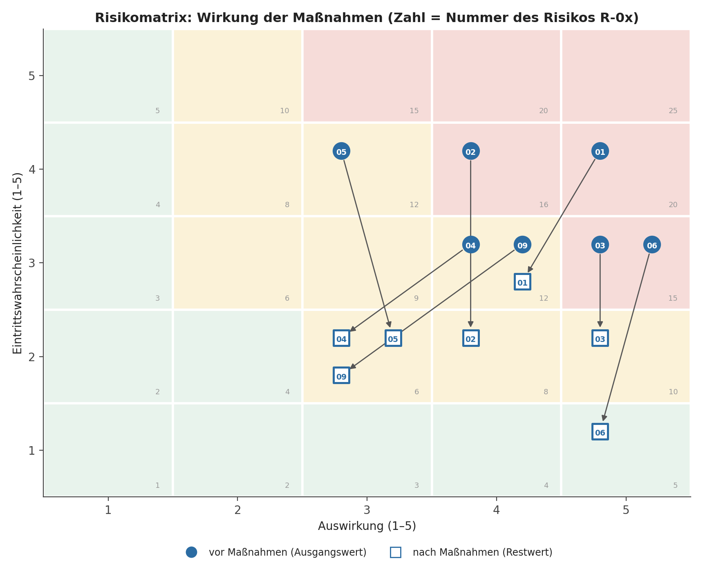

# 6. Risikomanagement

## 6.1 Bewertungsmethode

- Eintrittswahrscheinlichkeit: 1 bis 5
- Schadensauswirkung: 1 bis 5
- Risikowert: Wahrscheinlichkeit × Auswirkung

| Risikowert | Klassifizierung |
|---:|---|
| 1–5 | Niedrig |
| 6–12 | Mittel |
| 15–25 | Hoch |

## 6.2 Steuerungsprozess

1. Risiko identifizieren.
2. Ursache, Ereignis und Auswirkung beschreiben.
3. Eigentümer festlegen.
4. Präventiv- und Notfallmaßnahmen definieren.
5. Rest-Risiko bewerten.
6. Im regelmäßigen Projektreview aktualisieren.

## 6.3 Top-Risiken

| ID | Risiko | Ausgangswert | Maßnahme | Restwert |
|---|---|---:|---|---:|
| R-01 | Lieferverzug des Leistungsschalters | 20 | Frühe Vergabe, verbindlicher Fertigungsplan, Fortschrittsreviews | 12 |
| R-02 | Schnittstellen passen nicht zur Bestandsanlage | 16 | 3D-Aufmaß, Schnittstellenliste, Design Review | 8 |
| R-03 | Abschaltfenster wird verschoben | 15 | Alternative Termine, frühe Betriebsabstimmung | 10 |
| R-04 | Verdeckte Schäden am Fundament | 12 | Voruntersuchung und Reparaturkonzept | 6 |
| R-05 | Unvollständige Dokumentation | 12 | Dokumentenplan, Rückhaltebetrag, Review-Gates | 6 |
| R-06 | Sicherheitsverstoß auf der Baustelle | 15 | Sicherheitsunterweisung, Kontrollen, Stop-Work-Regel | 5 |
| R-09 | Kapazitätsengpass Montageteam im Abschaltfenster | 12 | Springer-Vereinbarung, Tagesplanung, Vorfertigung | 6 |

## 6.4 Chancen

- Standardisierung von Prüf- und Abnahmeunterlagen.
- Verkürzung zukünftiger Ausschreibungen durch wiederverwendbare Spezifikation.
- Verbesserung der digitalen Bestandsdokumentation.
- Reduzierung zukünftiger Wartungszeiten.

## 6.5 Ursachenanalyse der Top-Risiken

| ID | Risiko | Ursachen | Ereignis | Auswirkung |
|---|---|---|---|---|
| R-01 | Lieferverzug des Leistungsschalters | Ausgelastete Fertigungskapazität; späte Bestellung von Zulieferteilen; verspätete Zeichnungsfreigabe; geringe Fortschrittstransparenz | FAT oder Lieferung liegen nach dem Plan (30.06. bzw. 31.08.2026) | Kritischer Pfad verschiebt sich, das Abschaltfenster ist gefährdet |
| R-02 | Schnittstellen passen nicht zur Bestandsanlage | Unvollständige Bestandsdokumentation; Abweichung zwischen Zeichnung und Ist-Zustand; fehlende Schnittstellenliste | Neugerät passt mechanisch oder elektrisch nicht | Umbau im Abschaltfenster, Mehrkosten und Terminverzug (vgl. CR-002) |
| R-03 | Abschaltfenster wird verschoben | Netzsituation und Priorisierung im Netzbetrieb; parallele Abschaltungen; späte Abstimmung mit dem Betrieb | Betrieb verschiebt oder streicht das Fenster | Monteure und Inbetriebnahme stehen nicht zur Verfügung, mehrmonatiger Verzug |
| R-04 | Verdeckte Fundamentschäden | Alter der Anlage; unbekannte Schäden; keine Voruntersuchung | Bei der Demontage werden Schäden entdeckt | Reparatur im Fenster, Zusatzkosten und Verzug |
| R-05 | Unvollständige Dokumentation | Unklare Anforderungen im Bietergespräch; Fokus des Auftragnehmers auf die Montage; keine Prüfroutine | Abschlussdokumentation ist zu M8 unvollständig | Abnahme und Schlusszahlung verzögern sich |
| R-06 | Sicherheitsverstoß auf der Baustelle | Zeitdruck im Fenster; Fremdfirmenpersonal; Arbeiten nahe spannungsführender Teile; unzureichende Unterweisung | Unfall oder schwerer Verstoß | Personenschaden, Baustellenstopp, Terminverzug |
| R-09 | Kapazitätsengpass Montageteam im Abschaltfenster | Festes Zeitfenster; Teamgröße von 8 Personen; Abhängigkeiten zwischen Arbeitspaketen; Streuung der Schätzung (σ = 2,0 PT bei AP 6.3) | Tagesbedarf übersteigt die Teamkapazität | Verzug der Anschlussarbeiten im Fenster |

## 6.6 Bewertung und Wirkung der Maßnahmen

Risikowert = Eintrittswahrscheinlichkeit (W) × Auswirkung (A), jeweils 1 bis 5. Die Restwerte gelten nach Umsetzung der Maßnahmen.

| ID | W | A | Ausgangswert | Präventive Maßnahmen | Korrektive Maßnahmen | W' | A' | Restwert | Wirkung |
|---|---:|---:|---:|---|---|---:|---:|---:|---:|
| R-01 | 4 | 5 | 20 | Frühe Vergabe, verbindlicher Fertigungsplan im Vertrag, Fortschrittsreviews alle 2 Wochen | Zusatzschichten auf Kosten des Auftragnehmers, alternativer FAT-Termin, Vertragsstrafe | 3 | 4 | 12 | −8 |
| R-02 | 4 | 4 | 16 | 3D-Aufmaß, Schnittstellenliste, Design Review (M4) | Vorgefertigte Adapterlösung | 2 | 4 | 8 | −8 |
| R-03 | 3 | 5 | 15 | Schriftliche Bestätigung mindestens 6 Monate vorher, frühe Einbindung des Betriebs | Alternativtermine vorab abgestimmt, Eskalation an den Lenkungskreis | 2 | 5 | 10 | −5 |
| R-04 | 3 | 4 | 12 | Voruntersuchung, Reparaturkonzept | Nutzung der Reserve | 2 | 3 | 6 | −6 |
| R-05 | 4 | 3 | 12 | Dokumentenplan, Rückhaltebetrag (5 % Zahlungsmeilenstein), Review-Gates | Mahnung, Ersatzvornahme | 2 | 3 | 6 | −6 |
| R-06 | 3 | 5 | 15 | Sicherheitsunterweisung, Kontrollen, Freigabe des Sicherheitskonzepts vor Baustart (A-006) | Stop-Work-Regel | 1 | 5 | 5 | −10 |
| R-09 | 3 | 4 | 12 | Springer-Vereinbarung (2 Monteure auf Abruf), Tagesplanung, Vorfertigung | Umpriorisierung der Vorarbeiten, Zusatzschicht | 2 | 3 | 6 | −6 |
| | | | **102** | | | | | **53** | **−49** |

**Wirkung im Gesamtbild:** Die Summe der Risikowerte sinkt von 102 auf 53, das sind 48 %. Präventive Maßnahmen senken vor allem die Wahrscheinlichkeit (R-02, R-03, R-04, R-05, R-06, R-09). Bei R-01 wirken sie auf beide Größen: Die Auswirkung sinkt, weil ein Verzug durch Puffer, Vertragsstrafe und alternativen FAT-Termin abgefedert wird. Die Daten stehen in `data/risikoregister.csv`.

## 6.7 Risikomatrix

Klassen: 1–5 niedrig (grün), 6–12 mittel (gelb), 15–25 hoch (rot). Vor den Maßnahmen liegen R-01, R-02, R-03 und R-06 im hohen Bereich. Nach den Maßnahmen liegt kein Risiko mehr im hohen Bereich.

## 6.8 Chancen

Chancenwert = Eintrittswahrscheinlichkeit (W) × Nutzen (N), jeweils 1 bis 5. Die Daten stehen in `data/chancenregister.csv`.

| ID | Chance | Voraussetzung | W | N | Wert | Fördernde Maßnahmen | W' | N' | Wert danach | Verantwortlich |
|---|---|---|---:|---:|---:|---|---:|---:|---:|---|
| C-01 | Standardisierung der Prüf- und Abnahmeunterlagen | Prüfplan und Checklisten werden früh mit dem Auftragnehmer abgestimmt | 4 | 3 | 12 | Prüfplan im Design Review festlegen, Vorlagen versionieren, Erfahrungen an Projekt P3 zurückgeben | 5 | 3 | 15 | Fachprojektleitung |
| C-02 | Wiederverwendbare Spezifikation verkürzt künftige Ausschreibungen | Lastenheft und Bewertungsmatrix sind modular aufgebaut | 3 | 4 | 12 | Lastenheft modular gliedern, Bewertungsmatrix als Vorlage ablegen, Optionspositionen für Folgeaufträge vereinbaren | 4 | 4 | 16 | Einkauf |
| C-03 | Bessere digitale Bestandsdokumentation senkt künftige Planungs- und Wartungszeiten | Aufmaßdaten und Herstellerdokumentation liegen digital vor | 3 | 3 | 9 | Aufmaßdaten als digitale Anlagenakte fordern, digitale Herstellerdokumentation vertraglich festlegen, Zustandsmeldung nutzen (CR-001) | 4 | 3 | 12 | Projektleitung |

## 6.9 Übrige Risiken im Register

Das vollständige Register (`data/risikoregister.csv`) enthält neun Risiken. Die Abschnitte 6.3 bis 6.7 vertiefen die sieben Risiken mit dem größten Einfluss auf Termin und Sicherheit. Die beiden übrigen Risiken werden im Register geführt und wie folgt bewertet:

| ID | Risiko | W | A | Ausgangswert | Maßnahme | W' | A' | Restwert | Begründung für die Einordnung |
|---|---|---:|---:|---:|---|---:|---:|---:|---|
| R-07 | Kran oder Transportmittel nicht verfügbar | 2 | 4 | 8 | Frühe Reservierung, Ersatzanbieter (siehe 23.2, S2 und S3) | 1 | 4 | 4 | Niedrige Wahrscheinlichkeit, Ersatzanbieter verfügbar |
| R-08 | FAT zeigt kritische Funktionsabweichung | 3 | 4 | 12 | Vorabtest, Prüflistenreview, alternativer FAT-Termin | 2 | 4 | 8 | Wirkung ist über den Pufferplan von R-01 (Lieferverzug) abgedeckt |

Die Summe über alle neun Risiken sinkt von 122 auf 65 (−57). Die Kennzahl 102 auf 53 in 6.6 bezieht sich nur auf die sieben vertieften Risiken.
