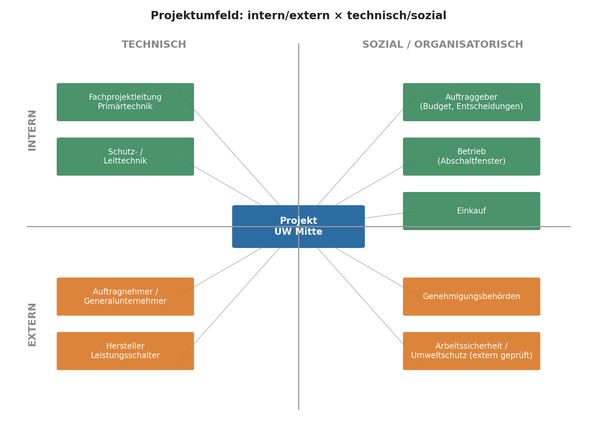
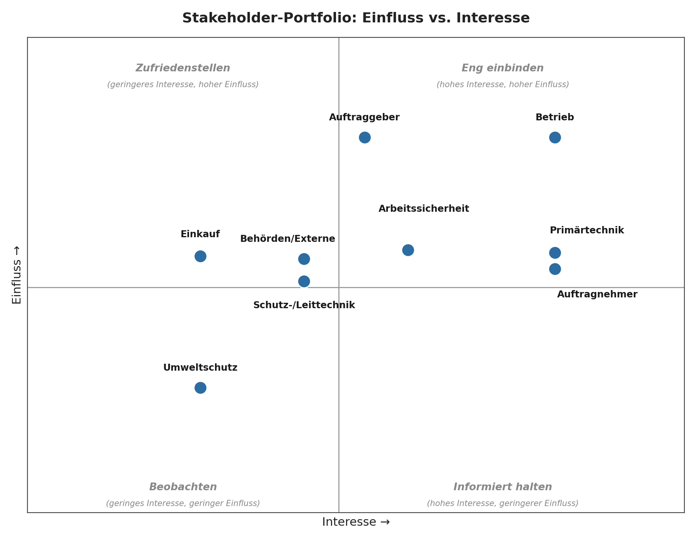

# 15. Projektumfeld, Schnittstellen und Stakeholder-Portfolio

## 15.1 Projektumfeld

Das Projekt bewegt sich in einem Umfeld aus internen/externen und technischen/sozialen Einflussfaktoren. Die folgende Darstellung ordnet die wichtigsten Umfeldfaktoren diesen vier Feldern zu:

Intern-technische Faktoren (Fachprojektleitung Primärtechnik, Schutz-/Leittechnik) bestimmen, ob die Lösung überhaupt zur Bestandsanlage passt. Intern-soziale Faktoren (Auftraggeber, Betrieb, Einkauf) bestimmen Budget, Freigaben und das Abschaltfenster. Extern-technische Faktoren (Auftragnehmer, Hersteller) liefern die eigentliche Ausrüstung und Montageleistung. Extern-soziale Faktoren (Genehmigungsbehörden, extern geprüfte Arbeitssicherheits-/Umweltauflagen) setzen den regulatorischen Rahmen, auf den das Projekt reagieren, aber den es nicht verändern kann.

## 15.2 Schnittstellen

**Schnittstelle 1 – Technische Schnittstelle zur Sekundär-/Schutztechnik**
- **Partner:** Fachbereich Schutz- und Leittechnik
- **Gegenstand:** Melde-, Steuer- und Schutzsignale zwischen neuem Leistungsschalter und bestehender Schutztechnik (siehe Anforderung A-003).
- **Risiko bei fehlendem Management:** Fehlfunktion oder ungewollte Netzabschaltung bei Inbetriebnahme.
- **Managementmaßnahme:** Frühzeitige Signal- und Schnittstellenliste, gemeinsamer Design Review vor Fertigungsfreigabe (Meilenstein M4), gemeinsamer Funktionstest vor Abnahme.

**Schnittstelle 2 – Organisatorische Schnittstelle zum Betrieb (Abschaltplanung)**
- **Partner:** Betrieb (Anlagenverantwortliche)
- **Gegenstand:** Freigabe und verbindliche Terminierung des 10-tägigen Abschaltfensters, in dem Montage, Prüfung und Inbetriebnahme stattfinden müssen.
- **Risiko bei fehlendem Management:** Verschiebung des Abschaltfensters (Risiko R-03) gefährdet den gesamten kritischen Pfad, da Montage- und Inbetriebnahmeressourcen nur in diesem Fenster verfügbar sind.
- **Managementmaßnahme:** Frühzeitige, schriftlich bestätigte Terminabstimmung mit dem Betrieb (spätestens sechs Monate vorher, siehe 2.5), regelmäßige Statusabstimmung im Lenkungskreis.

**Schnittstelle 3 – Mechanische Schnittstelle zur Bestandsanlage**
- **Partner:** Hersteller / Auftragnehmer
- **Gegenstand:** Fundament- und Anschlussgeometrie zwischen Neugerät und bestehender Stahlbau-/Sammelschienenkonstruktion (siehe Anforderung A-002, Change CR-002).
- **Risiko bei fehlendem Management:** Wie bereits im Change-Beispiel CR-002 eingetreten, führen abweichende Befestigungspunkte zu Mehrkosten und Terminverzug im kritischen Abschaltfenster.
- **Managementmaßnahme:** 3D-Aufmaß vor Detailengineering, Design Review, vorgefertigte Adapterlösung.

## 15.3 Stakeholder-Portfolio (Einfluss vs. Interesse)

Die Positionierung im Portfolio bestätigt und begründet die in 7.1 gewählten Strategien:

| Quadrant | Stakeholder | Begründung der Strategie |
|---|---|---|
| Eng einbinden | Betrieb, Primärtechnik, Auftragnehmer | Hohes Interesse und hoher Einfluss auf Termin, Technik bzw. Lieferung – ohne enge Einbindung droht Verzug oder technische Fehlanpassung. |
| Zufriedenstellen | Auftraggeber | Hoher Einfluss (Budget- und Entscheidungsgewalt), aber im Tagesgeschäft geringeres direktes Interesse an operativen Details – wird über Entscheidungsreporting eingebunden, nicht operativ. |
| Informiert halten / beobachten | Einkauf, Behörden, Arbeitssicherheit, Umweltschutz, Schutz-/Leittechnik | Mittlerer bis situativer Einfluss – werden zu den für sie relevanten Zeitpunkten (Vergabe, Genehmigung, Baustellenphase) informiert bzw. beteiligt, ohne dauerhaft im Kernteam gebunden zu sein. |

## 15.4 Macht und Interessen: Machtpromotoren

Zwei Stakeholder wirken im Projekt als **Machtpromotoren**, deren aktive Unterstützung projektentscheidend ist:

- **Auftraggeber:** verfügt über Budgetfreigabe und strategische Entscheidungsgewalt (siehe 1.6/1.7). Seine frühzeitige und sichtbare Unterstützung der Projektziele legitimiert Entscheidungen der Projektleitung gegenüber allen übrigen Stakeholdern.
- **Betrieb:** verfügt faktisch über ein Vetorecht, da ohne die Freigabe des Abschaltfensters keine Montage stattfinden kann. Die frühzeitige, persönliche Einbindung des Betriebs (siehe 17. Kommunikationsmodell) war notwendig, um dieses Machtpotenzial in Unterstützung statt in Blockade umzuwandeln.

Die Strategie der Projektleitung bestand darin, beide Promotoren früh und mit klaren, überprüfbaren Zusagen (Meilensteine, Entscheidungsvorlagen) einzubinden, statt ihre Zustimmung erst bei Bedarf einzuholen.
