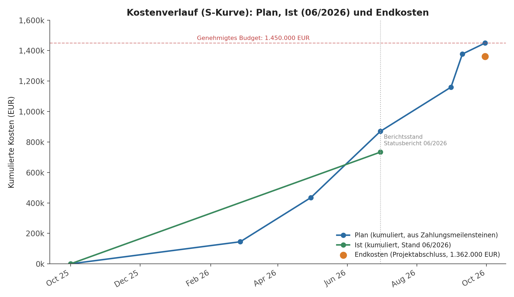
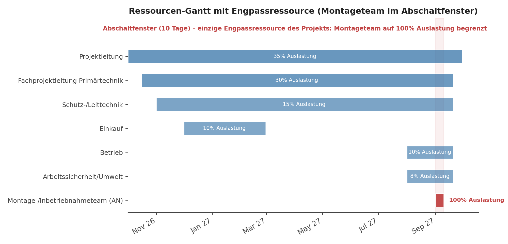

# 18. Kostenkurven und Ressourcenauslastung

## 18.1 Kostenkurve (kumuliert): Plan, Ist und Prognose

Die kumulierte Plankurve wird aus den Zahlungsmeilensteinen (5.3) in Verbindung mit den Meilensteinterminen (4.1) abgeleitet; die Ist-Kurve zum Berichtsstand 06/2026 stammt aus `data/budgetplan.csv` (Spalte `Ist_06_2026_EUR`, siehe Statusbericht 12), die Endkosten aus den Spalten `Ist_EUR` bzw. `Prognose_EUR` (Stand Projektabschluss).

| Zeitpunkt | Meilenstein | Plan kumuliert | Ist / Prognose |
|---|---|---:|---:|
| 27.02.2026 | M3 Vergabe (10 %) | 145.000 EUR | – |
| 30.04.2026 | M4 Design Review (30 % kum.) | 435.000 EUR | – |
| 30.06.2026 | M5 FAT (60 % kum.) | 870.000 EUR | Ist 733.500 EUR |
| 31.08.2026 | M6 Lieferung (80 % kum.) | 1.160.000 EUR | – |
| 10.09.2026 | M7 Inbetriebnahme (95 % kum.) | 1.377.500 EUR | – |
| 30.09.2026 | M8 Abschluss (100 % kum.) | 1.450.000 EUR | Endkosten 1.362.000 EUR |

**Interpretation:** Zum Berichtsstand (Ende Juni 2026) liegen die tatsächlichen Kosten (733.500 EUR) unterhalb der Planlinie (870.000 EUR) – dies ist konsistent mit dem im Statusbericht (12.3) ausgewiesenen „Grün"-Status bei Kosten. Die Prognose lag im Juni bei 1.438.000 EUR. Die Endkosten zum Projektabschluss betragen 1.362.000 EUR und liegen 88.000 EUR bzw. 6,1 % unter dem genehmigten Budget (Aufschlüsselung in 5.5); die Toleranz von 5 % für Überschreitungen (siehe Erfolgskennzahl 1.5) ist eingehalten.

## 18.2 Ressourcen-Gantt und Engpassressource

Während Projektleitung, Fachprojektleitung und Schutz-/Leittechnik über die gesamte Projektlaufzeit mit moderater, planbarer Teilauslastung (15–35 % FTE, siehe 5.4) eingebunden sind, ist das **Montage-/Inbetriebnahmeteam des Auftragnehmers die einzige echte Engpassressource** des Projekts:

- Es ist ausschließlich innerhalb des 10-tägigen Abschaltfensters verfügbar bzw. einsetzbar, da vorher keine spannungsfreie Baustelle existiert.
- Innerhalb dieses Fensters liegt die Auslastung an den Tagen 1–7 bei 100 % (Durchschnitt über alle zehn Tage: 84 %, siehe 23.4) – es gibt keinen Zeitpuffer, um Verzögerungen an anderer Stelle (z. B. verspätete Fertigung, siehe R-01) aufzufangen.
- Jede Verschiebung des Fensters (R-03) oder jede unvorhergesehene Komplikation während der Montage (z. B. CR-002) wirkt sich unmittelbar und ungepuffert auf den kritischen Pfad aus (siehe 4.2).

**Steuerungskonsequenz:** Aus diesem Engpass leitet sich die in 4.3 beschriebene Eskalationsregel ab (Eskalation bereits ab fünf Arbeitstagen Prognoseverzug) sowie die Entscheidung, das Arbeitspaket „Neugerät montieren" (16.3) vollständig mit Akzeptanzkriterien und Definition of Done auszuarbeiten: Für die einzige Ressource ohne Puffer darf es keine Unklarheit über den Abschlusszeitpunkt geben.
